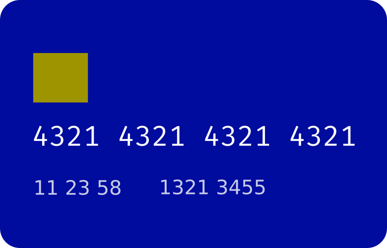

<p align="center">
  <a href="https://github.com/$username-github/$nome-repositorio">
    
  </a>

  <h2 align="center">
    Valex
  </h2>
  <p align="center"> Valex is a benefit card API. The API will be responsible for creating, reloading, activating, as well as processing purchases. </p>
</p>

## Usage

```bash
$ git clone https://github.com/rods-duarte/projeto-valex

$ cd projeto-valex

$ npm install

$ npm run dev
```

API:

```
- POST /cards/new/:employeeId
    - Route to register a new card for an employee
    - headers: {"x-api-key": "api-key"}
    - body: {
        "cardType": "groceries" | "restaurant" | "transport" | "education" | "health"
      }
      
- PUT /cards/:id/activate
    - Route to card activation
    - headers: {}
    - body: {
        "password": "1234"
      }
      
- PUT /cards/:id/block
    - Route to block card
    - headers: {}
    - body: {
        "password": "1234"
      }
      
- PUT /cards/:id/unblock
    - Route to unblock card
    - headers: {}
    - body: {
        "password": "1234"
      }
      
- GET /cards/:id/transactions
    - Route to get transaction and balance information
    - headers: {}
    - body: {}
    
- POST /payments/card/:id
    - Route to record a payment
    - headers: {}
    - body: {
        bussinessId: 1,
        amount: 100,
        cardPassword: "1234"
      }
      
- POST /recharges/card/:id
    - Route to record a recharge
    - headers: {"x-api-key": "api-key"}
    - body: {
        amount: 100,
      }
     
```

## Technologies
The following tools and frameworks were used in the construction of the project:<br>
<p>
  
  
  
</p>
